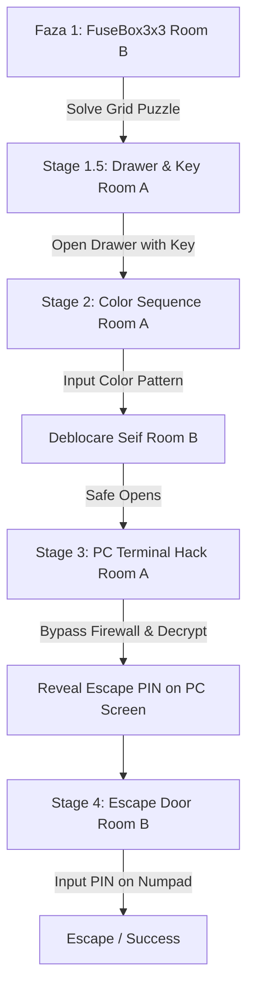

# 📄 CONTEXT_MANIFEST: Echo Chamber Co-op

## 1. Project Essence
**Echo Chamber** is an asymmetrical, cooperative escape room game where two players are trapped in isolated rooms (Room A and Room B) and must communicate verbally (e.g., via Discord) to solve interconnected, procedurally generated puzzles. A seed-based generation system ensures that every playthrough has unique puzzles, layouts, and code combinations.

---

## 2. Architecture & Scene Map

### Core Game System (Godot 4)
*   **Game State & Events (`src/Scripts/Core/GameEvents.gd`):** A global Autoload Singleton that acts as the game's State Machine. It manages the current game stage (`current_stage`) and acts as a central event bus for global game signals.
*   **Audio Manager (`src/Scripts/Core/AudioManager.gd`):** An Autoload Singleton managing background music (ambient track looping) and spatial sound effects (UI clicks, successful actions, and error tones).
*   **Local Test Manager (`src/Scripts/Core/LocalTestManager.gd`):** Manages local execution, player switching (TAB key), and player spawns for test levels.

### Player Controller & Interaction System
*   **Player Controller (`src/Scripts/Player/PlayerController.gd`):** 
    *   Standard first-person movement (enhanced with keyboard WASD input detection at the physical key code level: `KEY_W`, `KEY_A`, `KEY_S`, `KEY_D`, alongside traditional arrow keys).
    *   **Focus Mode ("Rusty Lake Style"):** Clicking on interactive objects (keypads, terminals) transitions the camera to Zoom-In mode, locks player movement, unlocks the mouse cursor, and routes mouse clicks directly onto 3D/2D Viewport objects. Pressing `ESC` or clicking Right Mouse Button exits focus mode.
    *   **Safeguard Switcher:** Safely handles player swapping (via `TAB` key), automatically exiting Zoom Focus Mode first to prevent camera detachments and game engine crashes.

### Agent Logic
1.  **Room Generator Agent (`src/Scripts/Agents/RoomGeneratorAgent.gd`):** Procedurally constructs the physical grids of Room A and Room B. Uses a deterministic seed to spawn modular assets, furniture slots, and walls. Leverages a relative "Socket System" to prevent object clipping when mounting props to desks or walls.
2.  **Puzzle Generator Agent (`src/Scripts/Agents/PuzzleGeneratorAgent.gd`):** The logic graph builder. Given a seed, it determines which room has the clue/solution and which room has the lock/mechanism, and generates puzzle solutions dynamically:
    *   `numpad_puzzle`: Numeric 4-digit code.
    *   `color_sequence`: Shuffled color pattern.
    *   `grid_puzzle`: 3x3 active grid state configuration.
    *   `math_puzzle`: Procedural item count (books + chairs) logic.
3.  **Hint Agent:** (Pending full implementation) Will track player telemetry to feed context-sensitive hints if stuck.
4.  **Saboteur Agent:** (Pending full implementation) Intended to trigger horror atmospheric elements (flickering lights, fake clues).

### Puzzle & Interactive Entities (`src/Scripts/Puzzles/`)
*   **`FuseBox3x3.gd` & `FuseButton.gd`:** Grid-based fuse box in Room B. Solving it turns on the lights in both rooms.
*   **`ColorButtonsPanel.gd` & `ColorButton.gd`:** Sequences of colored buttons in Room A.
*   **`ColorHintBoard.gd`:** Puzzle board showing clues for the color sequence.
*   **`Terminal.gd`:** SubViewport-driven screen running a virtual OS (800x600 resolution PlaneMesh). Translates 3D raycast hits into simulated 2D mouse clicks to interact with desktop buttons (Bypass Firewall, Decrypt, Access Core).
*   **`Numpad.gd` & `NumpadButton.gd`:** Wall-mounted keypad to input numerical codes.
*   **`Note.gd`:** Text sheets displaying generated puzzle clues.

### SaaS Backend
*   **SaaS Server (`backend/server.js`):** Express app running on port 3000.
*   **Authentication API (`backend/auth/auth.js`):** Basic user registration and login utilizing bcrypt password hashing and JSON Web Tokens (JWT).

---

## 3. Asymmetric Puzzle Progression Flow
Echo Chamber progresses through a linear sequence of stages. Puzzles belonging to future stages remain non-functional (unpowered or unclickable) until previous stages are resolved.

1.  **Faza 1 - Panoul Electric (FuseBox3x3):** The player in Room B solves a 3x3 grid puzzle to route power. This turns on the lights in both rooms and advances the game stage to `1.5`.
2.  **Faza 1.5 - Sertarul (Drawer):** The player in Room A locates a key to open the drawer. Opening the drawer emits a `drawer_opened` signal which powers up the `ColorButtonsPanel` in Room A (which was previously inactive and dark).
3.  **Faza 2 - Seiful (Safe):** The player in Room B finds color hints. The player in Room A inputs the correct color sequence on the powered-up color panel. Completing this advances the stage to `3` and triggers the safe in Room B (`safe_opened`).
4.  **Faza 3 - PC Terminal:** Unlocking the safe powers the computer terminal in Room A (makes the screen mesh visible). The player in Room A completes a 3-step firewall bypass puzzle (Bypass Firewall -> Decrypt Protocol -> Access Core). A successful hack displays the dynamically generated Escape PIN on the screen and advances the stage to `4`.
5.  **Faza 4 - Ușa de Evadare (Escape):** The player in Room B inputs the Escape PIN on the exit Numpad to unlock the armored door and win.

---

## 4. Current State of Development

*   **🟢 Implemented:**
    *   **Core State Machine & Autoloads:** `GameEvents.gd` stages flow and `AudioManager.gd` audio signals.
    *   **Advanced Focus Mode:** High fidelity FPS interaction with UI integration (no crashes on player swap).
    *   **Procedural Gen Systems:** Grid generator for rooms (`RoomGeneratorAgent.gd`) and data structures for asymmetric puzzles (`PuzzleGeneratorAgent.gd`).
    *   **Puzzle UI & Mechanisms:** Grid buttons, interactive computer terminals, keypad UI, color board, and drawer lock interactions.
    *   **Authentication API:** Backend registration and login endpoints.
    *   **Dynamic Hint System (`src/Scripts/Agents/HintAgent.gd`):** A context-aware system that tracks player positions, failed attempts, and puzzle states. Uses local Ollama LLM queries (optimized for low temperatures and token lengths) with deterministic static fallbacks. Triggers environment changes (flickering lights via `CeilingLightLogic.gd`, shaking furniture, and spawning wide, auto-fading 3D blood text hints).
*   **🟡 In Progress:**
    *   **Networking & Sync:** Connecting local puzzle state changes (e.g. lights on, drawer open, safe open) across clients using Godot P2P multiplayer.
*   **🔴 Planned / Missing:**
    *   **The Saboteur (Paranoia System):** An atmospheric director monitoring game pacing. Triggers distant door slams, 3D spatial footstep SFX, and stops ventilation systems during prolonged quiet periods.
    *   **Dynamic Difficulty Scaling:** Adapts challenge levels dynamically (e.g., if a team solves puzzles too quickly, subsequent codes like the final Numpad PIN dynamically switch to a more complex 6-digit format).
    *   **Time-Attack "Bomb" Event:** A mid-game emergency event triggering red alarm sirens and requiring both players to coordinate and cut specific panel wires simultaneously within a 3-minute window.
    *   **Leaderboard & SaaS Dashboard:** Connecting the backend Express API to Godot to log escape times.
    *   **Proximity Voice Chat:** 3D positional audio.
    *   **Atmospheric Polish:** Audio-visual horror style glitches.
