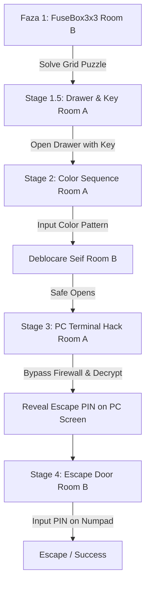

# 📄 CONTEXT_MANIFEST: Echo Chamber Co-op

## 1. Project Essence
**Echo Chamber** is an asymmetrical, cooperative escape room game where two players are trapped in isolated rooms (Room A and Room B) and must communicate verbally (e.g., via Discord) to solve interconnected, procedurally generated puzzles. A seed-based generation system ensures that every playthrough has unique puzzles, layouts, and code combinations.

---

## 2. Architecture & Scene Map

### Core Game System (Godot 4)
*   **Game State & Events (`src/Scripts/Core/GameEvents.gd`):** A global Autoload Singleton that acts as the game's State Machine. It manages the current game stage (`current_stage`) and acts as a central event bus for global game signals.
*   **Audio Manager (`src/Scripts/Core/AudioManager.gd`):** An Autoload Singleton managing background music (ambient track looping) and spatial sound effects (UI clicks, successful actions, and error tones).
*   **Local Test Manager (`src/Scripts/Core/LocalTestManager.gd`):** Manages local execution, player switching (TAB key), and player spawns for test levels.
*   **PBR Material Manager (`src/Scripts/Core/PBRMaterialManager.gd`):** A manager providing dynamically generated PBR materials (concrete, wood, metal, plastic, glass) and applying them to mesh instances at runtime to ensure consistent material rendering.
*   **Game Stats Tracker (`src/Scripts/Core/GameStats.gd`):** Singleton that tracks escape time, puzzles solved, mistakes, and calculates the final score/rank.

### Player Controller & Interaction System
*   **Player Controller (`src/Scripts/Player/PlayerController.gd`):** 
    *   Standard first-person movement (enhanced with keyboard WASD input detection at the physical key code level: `KEY_W`, `KEY_A`, `KEY_S`, `KEY_D`, alongside traditional arrow keys).
    *   **Focus Mode ("Rusty Lake Style"):** Clicking on interactive objects (keypads, terminals) transitions the camera to Zoom-In mode, locks player movement, unlocks the mouse cursor, and routes mouse clicks directly onto 3D/2D Viewport objects. Pressing `ESC` or clicking Right Mouse Button exits focus mode.
    *   **Safeguard Switcher:** Safely handles player swapping (via `TAB` key), automatically exiting Zoom Focus Mode first to prevent camera detachments and game engine crashes.
    *   **Multiplayer Authority Check:** Integrates with `MultiplayerSynchronizer` to disable processing, camera, and player input on remote clients where the local peer is not the authority.

### Agent Logic
1.  **Room Generator Agent (`src/Scripts/Agents/RoomGeneratorAgent.gd`):** Procedurally constructs the physical grids of Room A and Room B. Uses a deterministic seed to spawn modular assets, furniture slots, and walls. Leverages a relative "Socket System" to prevent object clipping when mounting props to desks or walls. Correctly sequences hierarchy initialization to avoid ready timing crashes.
2.  **Puzzle Generator Agent (`src/Scripts/Agents/PuzzleGeneratorAgent.gd`):** The logic graph builder. Given a seed, it determines which room has the clue/solution and which room has the lock/mechanism, and generates puzzle solutions dynamically:
    *   `numpad_puzzle`: Numeric 4-digit code.
    *   `color_sequence`: Shuffled color pattern.
    *   `grid_puzzle`: 3x3 active grid state configuration.
    *   `math_puzzle`: Procedural item count (books + chairs) logic.
3.  **Hint Agent (`src/Scripts/Agents/HintAgent.gd`):** Fully implemented context-aware feedback system. Tracks player positions, stage changes, and wrong attempt counts to generate hints via local Ollama LLM queries (optimized for speed and low temperature) or fallback static suggestions. Triggers environmental events such as light flickering, shaking furniture, and spawning 3D blood text decals.
4.  **Saboteur Agent (`src/Scripts/Agents/SaboteurAgent.gd`):** An LLM-based atmospheric horror director. Monitors player idle time and tension (0.0→1.0) and queries Ollama (`llama3:8b`) to dynamically select scare events. Coordinates with `HintAgent` to prevent concurrent Ollama requests. Exposes `register_wrong_attempt(puzzle_type, player_name)` — called by all puzzle scripts (`FuseBox3x3.gd`, `ColorButtonsPanel.gd`, `Terminal.gd`, `Numpad.gd`) on each mistake to immediately spike tension and panic, and optionally reduce the scare cooldown to 10s. Actuators: `DOOR_SLAM` (3D positional audio thud + camera shake), `FOOTSTEPS` (panning spatial audio), `VENTILATION_SHUTDOWN` (background music fade), `LIGHT_BLACKOUT` (via `GameEvents.room_lights_toggled`), `PLAYER_ISOLATION` (disables movement + glitch overlay for 6s), `ASYMMETRIC_WHISPER` (creepy text shown to one player only), `SPAWN_FAKE_CLUE` (instantiates `Note.tscn` with wrong puzzle instructions, auto-destroys after 25s).
5.  **Difficulty Agent (`src/Scripts/Agents/DifficultyAgent.gd`):** An LLM-based dynamic difficulty director. Subscribes to `GameEvents.stage_changed` to evaluate team performance (time elapsed and total mistakes fetched from `HintAgent`) at the transitions to Stage 2 and Stage 3. Queries Ollama (`llama3:8b`) to dynamically adjust the difficulty of subsequent puzzles (extending/shortening `color_sequence` or scaling the final `numpad_puzzle` PIN code between 3 and 6 digits).

### Puzzle & Interactive Entities (`src/Scripts/Puzzles/`)
*   **`FuseBox3x3.gd` & `FuseButton.gd`:** Grid-based fuse box in Room B. Solving it turns on the lights in both rooms.
*   **`ColorButtonsPanel.gd` & `ColorButton.gd`:** Sequences of colored buttons in Room A.
*   **`ColorHintBoard.gd`:** Puzzle board showing clues for the color sequence.
*   **`Terminal.gd`:** SubViewport-driven screen running a virtual OS (800x600 resolution PlaneMesh). Translates 3D raycast hits into simulated 2D mouse clicks to interact with desktop buttons (Bypass Firewall, Decrypt, Access Core).
*   **`Numpad.gd` & `NumpadButton.gd`:** Wall-mounted keypad to input numerical codes.
*   **`Note.gd`:** Text sheets displaying generated puzzle clues.

### SaaS Backend
*   **SaaS Server (`backend/server.js`):** Express app running on port 3000.
*   **Authentication API (`backend/auth/auth.js`):** Basic user registration and login utilizing bcrypt password hashing and JSON Web Tokens (JWT).

### Networking & Multiplayer Sync
*   **Network Manager (`src/Scripts/Networking/NetworkManager.gd`):** An Autoload Singleton managing Godot ENet-based multiplayer sessions (hosting and joining on port 7777). Handles peer connections/disconnections and dynamically instantiates player scenes, assigning authority.

### Automated Testing & CI/CD
*   **Hint Agent Evaluation ([eval_hint_agent.gd](file:///c:/Users/alexi/Desktop/Echo-Chamber-Coop/tests/eval_hint_agent.gd)):** A headless test runner verifying the HintAgent's prompt generation format, static fallback dictionaries, and wrong-attempt state tracking logic.
*   **Saboteur Agent Evaluation ([eval_saboteur_agent.gd](file:///c:/Users/alexi/Desktop/Echo-Chamber-Coop/tests/eval_saboteur_agent.gd)):** A headless test runner verifying the SaboteurAgent's prompt telemetry, JSON schema parsing, static action fallbacks per stage, and fallback fake clues.
*   **Difficulty Agent Evaluation ([eval_difficulty_agent.gd](file:///c:/Users/alexi/Desktop/Echo-Chamber-Coop/tests/eval_difficulty_agent.gd)):** A headless test runner verifying the DifficultyAgent's mistakes accumulation, prompt creation, and response parsing.
*   **CI/CD Workflow ([ci.yml](file:///c:/Users/alexi/Desktop/Echo-Chamber-Coop/.github/workflows/ci.yml)):** Automatically runs Express backend dependency checks/tests, runs `gdlint` on GDScript files, and executes the Godot test suite (`eval_hint_agent.gd`, `eval_saboteur_agent.gd`, and `eval_difficulty_agent.gd`) in headless mode.
*   **Running Tests Locally:**
    *   From the repository root:
        ```bash
        godot --headless --path src -s tests/eval_hint_agent.gd
        godot --headless --path src -s tests/eval_saboteur_agent.gd
        godot --headless --path src -s tests/eval_difficulty_agent.gd
        ```
    *   From the `src/` directory:
        ```bash
        cd src
        godot --headless -s ../tests/eval_hint_agent.gd
        godot --headless -s ../tests/eval_saboteur_agent.gd
        godot --headless -s ../tests/eval_difficulty_agent.gd
        ```
    *(If the `godot` command is not in your system's PATH, substitute it with the absolute path to your Godot executable, e.g. `& "C:\Path\To\Godot_v4.x.exe"` in PowerShell).*

### Accompanying Documentation
*   **Architecture & Workflow Diagrams (`diagrame_arhitectura.md`):** Mermaid documentation detailing UML classes, stage workflow, and raycast Focus Mode sequences.
*   **AI Usage Report (`raport_ai.md`):** Team usage details of AI pair-programming, showing how agentic assistants helped resolve math translations, CI/CD setup, and state machine flows.

---

## 3. Asymmetric Puzzle Progression Flow
Echo Chamber progresses through a linear sequence of stages. Puzzles belonging to future stages remain non-functional (unpowered or unclickable) until previous stages are resolved.



1.  **Faza 1 - Panoul Electric (FuseBox3x3):** The player in Room B solves a 3x3 grid puzzle to route power. This turns on the lights in both rooms and advances the game stage to `1.5`.
2.  **Faza 1.5 - Sertarul (Drawer):** The player in Room A locates a key to open the drawer. Opening the drawer emits a `drawer_opened` signal which powers up the `ColorButtonsPanel` in Room A (which was previously inactive and dark).
3.  **Faza 2 - Seiful (Safe):** The player in Room B finds color hints. The player in Room A inputs the correct color sequence on the powered-up color panel. Completing this advances the stage to `3` and triggers the safe in Room B (`safe_opened`).
4.  **Faza 3 - PC Terminal:** Unlocking the safe powers the computer terminal in Room A (makes the screen mesh visible). The player in Room A completes a 3-step firewall bypass puzzle (Bypass Firewall -> Decrypt Protocol -> Access Core). A successful hack displays the dynamically generated Escape PIN on the screen and advances the stage to `4`.
5.  **Faza 4 - Ușa de Evadare (Escape):** The player in Room B inputs the Escape PIN on the exit Numpad to unlock the armored door and win.

---

## 4. Current State of Development

*   **🟢 Implemented:**
    *   **Core State Machine & Autoloads:** `GameEvents.gd` stages flow and `AudioManager.gd` audio signals.
    *   **Advanced Focus Mode:** High fidelity FPS interaction with UI integration (no crashes on player swap).
    *   **Procedural Gen Systems:** Grid generator for rooms (`RoomGeneratorAgent.gd`) and data structures for asymmetric puzzles (`PuzzleGeneratorAgent.gd`).
    *   **Puzzle UI & Mechanisms:** Grid buttons, interactive computer terminals, keypad UI, color board, and drawer lock interactions.
    *   **Authentication API:** Backend registration and login endpoints.
    *   **Dynamic Hint System (`src/Scripts/Agents/HintAgent.gd`):** A context-aware system that tracks player positions, failed attempts, and puzzle states. Uses local Ollama LLM queries with deterministic static fallbacks.
    *   **Networking & Lobby Core:** Autoload singleton `NetworkManager.gd` for creating hosts/clients and spawning networked players.
    *   **Multiplayer Player Controller:** Integrated MultiplayerSynchronizer checks to restrict movement and camera control to local authorities.
    *   **PBR Materials Override:** `PBRMaterialManager.gd` ensuring correct visual properties for all procedural elements.
    *   **Headless Test Suite:** `eval_hint_agent.gd`, `eval_saboteur_agent.gd`, `eval_difficulty_agent.gd` and GitHub Actions `.github/workflows/ci.yml`.
    *   **Saboteur Agent (`src/Scripts/Agents/SaboteurAgent.gd`):** LLM-based atmospheric director that monitors player idle time and tension. Triggers dynamic scare events (blackouts, door slams, isolation, whispers, fake clues) using Ollama.
    *   **Dynamic Difficulty Scaling (`src/Scripts/Agents/DifficultyAgent.gd`):** LLM-based director adjusting puzzle sizes (color sequence length, PIN code length) at runtime based on performance.
    *   **EndGame Analytics Screen (`src/Scripts/UI/EndGameScreen.gd`):** Shows S-D rank, total escape time, mistakes count, and calculate a score out of 100 after escaping.
    *   **Networked AI Painting (`src/Scripts/Networking/PaintingAI.gd`):** Synchronizes generated AI hints and clues (Pollinations.ai/DALL-E) seamlessly between host and client via RPC calls.
    *   **Walkie-Talkie Voice Chat (`src/Scripts/Networking/WalkieTalkie.gd`):** VoIP implemented via RPC sending audio chunks through a Radio bus with custom effects.
    *   **Atmospheric Polish (`src/Scripts/Agents/SaboteurAgent.gd`):** Audio-visual horror style glitches, text overlays, and isolation mechanics fully integrated.
*   **🟡 In Progress:**
    *   **Networking & Sync:** Connecting more local puzzle state changes (e.g. lights on, drawer open, safe open) across clients using Godot P2P multiplayer.
*   **🔴 Planned / Missing:**
    *   **Time-Attack "Bomb" Event:** A mid-game emergency event triggering red alarm sirens and requiring both players to coordinate and cut specific panel wires simultaneously within a 3-minute window.
    *   **Leaderboard & SaaS Dashboard:** Connecting the backend Express API to Godot to log escape times.
