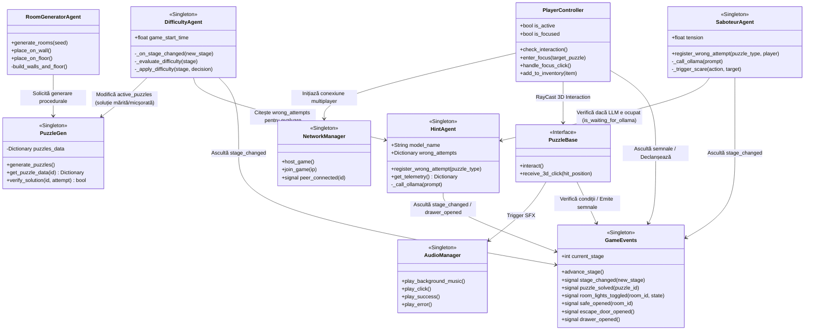
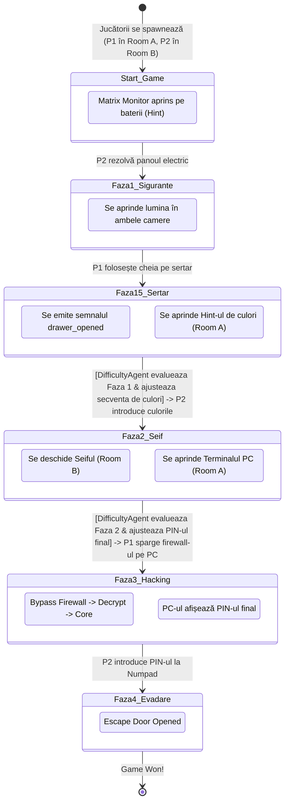
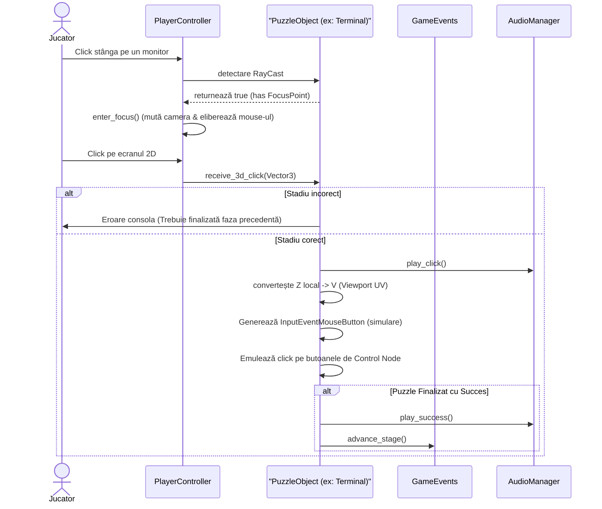

# Diagrame de Arhitectură și Workflow - Echo Chamber Co-op

## 1. Arhitectura Componentelor (UML Class Diagram)
Această diagramă ilustrează structura Singleton-urilor și a claselor principale, evidențiind modul de comunicare între sistemele de bază (Autoloads), Generatoarele de camere și controllerele jucătorilor.

## 2. Diagrama de Flux a Jocului (Workflow / State Diagram)
Aici este descris flow-ul liniar și strict al Escape Room-ului, demonstrând legătura cooperativă dintre Camera A și Camera B.

## 3. Workflow de Interacțiune (Sequence Diagram)
O diagramă detaliată despre cum funcționează sistemul unic de "Focus Mode" (click pe ecrane 3D).

