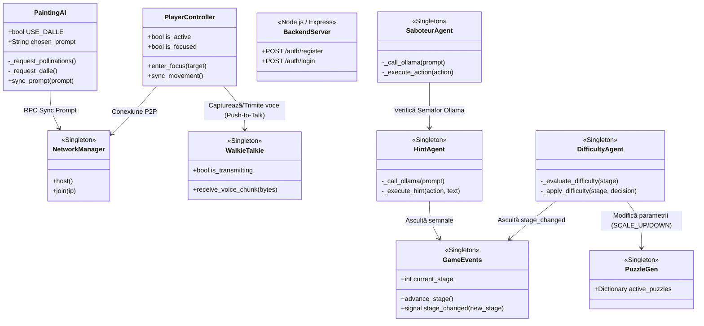
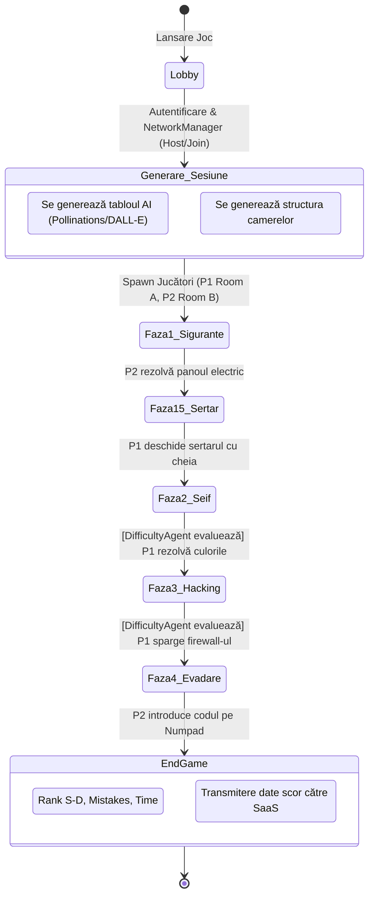
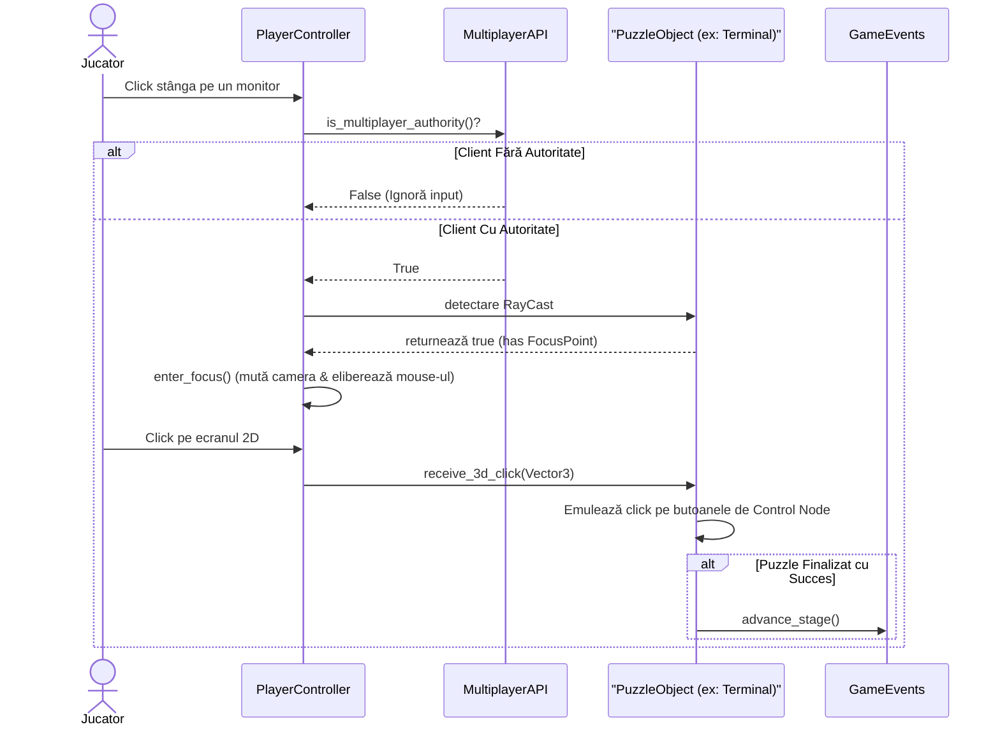
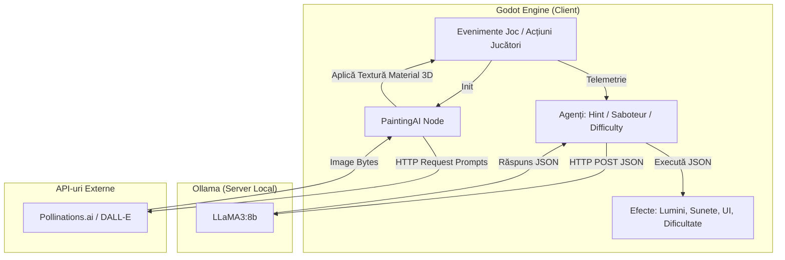
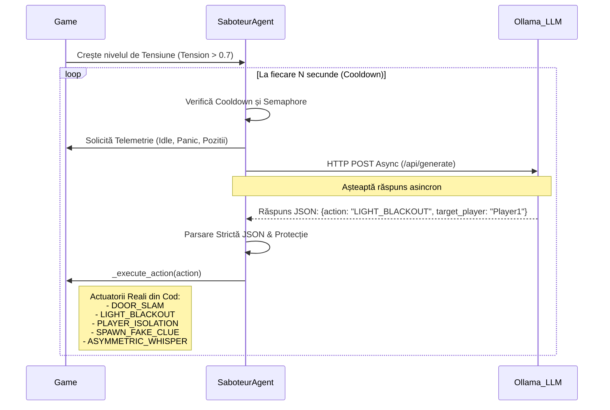
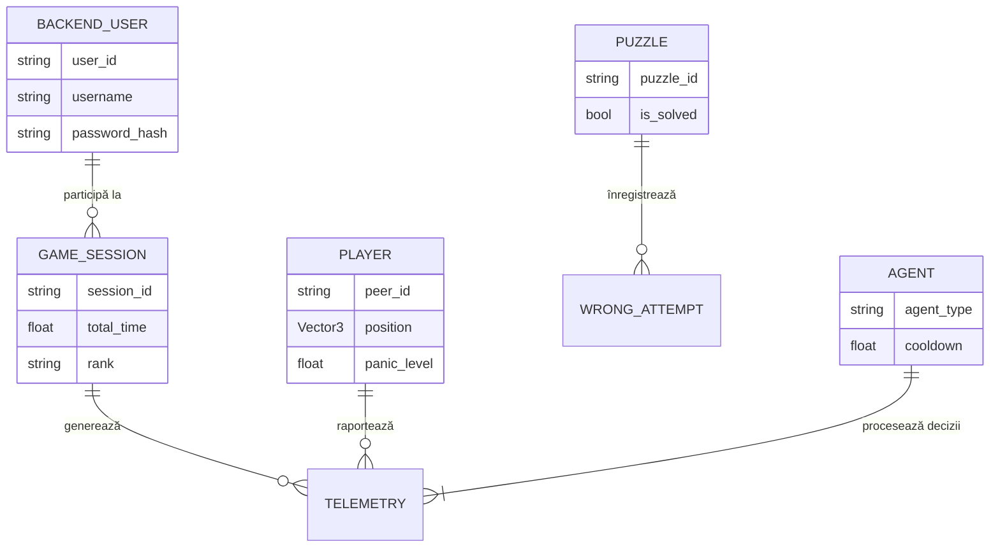
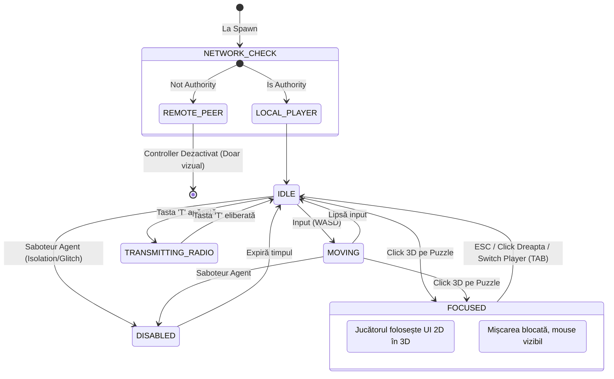

# Diagrame de Arhitectură și Workflow - Echo Chamber Co-op

## 1. Arhitectura Componentelor (UML Class Diagram)
Această diagramă ilustrează structura Singleton-urilor, a claselor principale, și a noilor componente de rețea, AI Generativ și Backend, evidențiind modul de comunicare global.



## 2. Diagrama de Flux a Jocului (Workflow / State Diagram)
Flow-ul actualizat al Escape Room-ului, incluzând conectarea multiplayer, generarea AI-ului vizual la început și încheierea sesiunii cu afișarea ecranului de final.



## 3. Workflow de Interacțiune (Sequence Diagram)
Diagrama detaliată pentru "Focus Mode", actualizată pentru a include verificările stricte de rețea (`is_multiplayer_authority`).



## 4. Arhitectura Sistemului AI (Integrarea cu Ollama & API-uri Externe)
Această diagramă ilustrează noile direcții ale inteligenței artificiale din proiect: LLM-urile locale (Ollama) care operează prin agenți și generatoarele externe de imagini (PaintingAI).



## 5. Secvența de Comunicare Agent-LLM (Agent-Sequence Diagram)
Acțiunile exacte extrase din codul sursă pentru `SaboteurAgent`, ilustrând modul în care generează evenimente asimetrice de groază fără a bloca jocul.



## 6. Pipeline CI/CD (Workflow)
Fluxul automatizat prin GitHub Actions, incluzând verificarea noului backend Express.

```mermaid
flowchart LR
    Dev[Dezvoltator] -->|Push / Pull Request| GitHub_Repo[(GitHub Repository)]
    
    subgraph Pipeline_CICD ["Pipeline CI/CD (GitHub Actions)"]
        Direction TB
        BackendTests[npm test pe backend]
        Linter[gdtoolkit / GDLint pe Godot]
        GodotTests[Godot Headless Evals: Hint, Saboteur, Difficulty]
        
        BackendTests --> Linter
        Linter --> GodotTests
    end
    
    GitHub_Repo --> Pipeline_CICD
    GodotTests -->|Build OK| Release([Release / Versiune Stabilă])
```

## 7. Structura Datelor de Joc (Entity Relationship Diagram - ERD)
Extinderea modelului de date pentru a include logarea la backend-ul SaaS și sincronizarea statisticilor per jucător.



## 8. State Machine - Player Controller
Automatul de stări (State Machine) extins din codul `PlayerController.gd`, tratând logica de rețea, Walkie-Talkie-ul și comutarea între Focus Mode.


