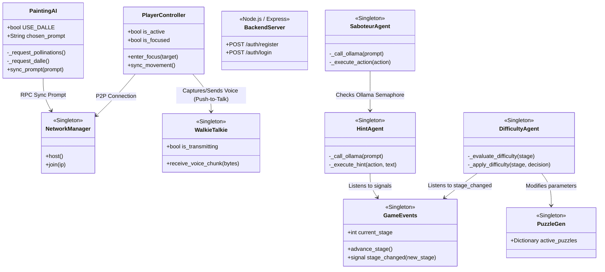
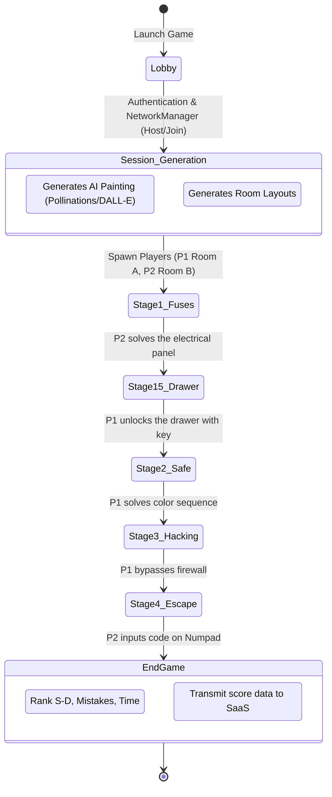
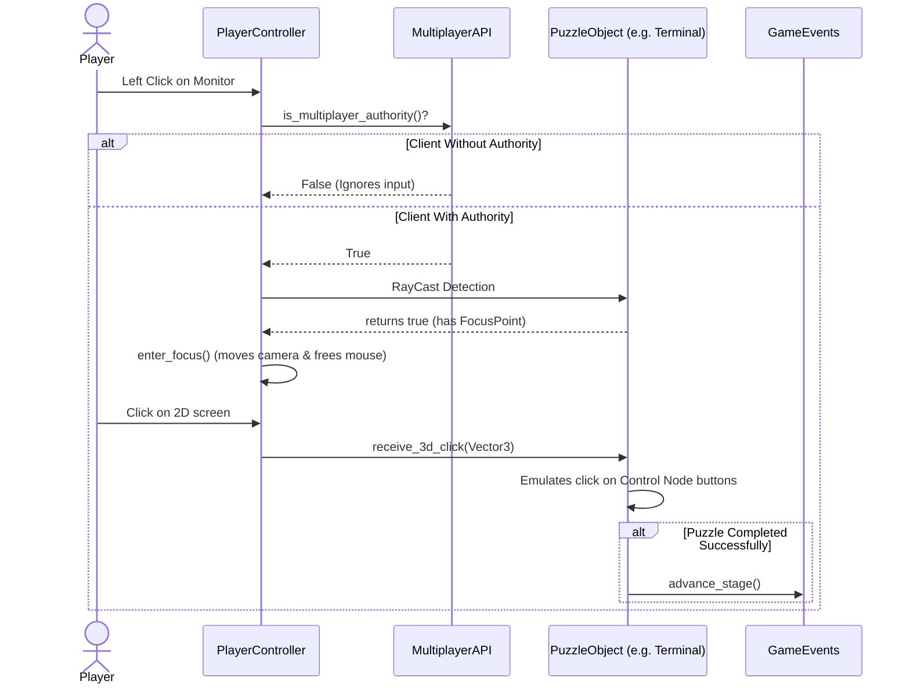
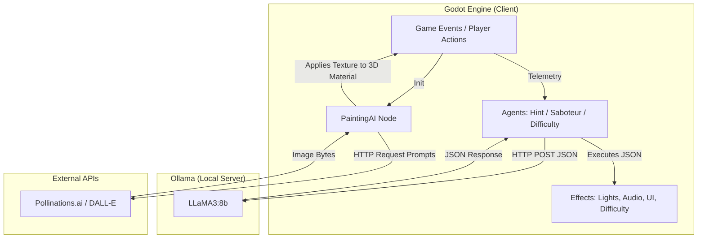
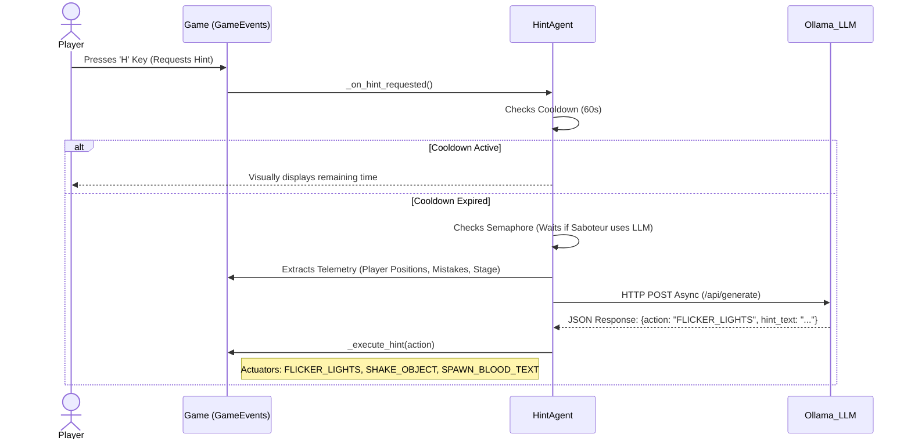
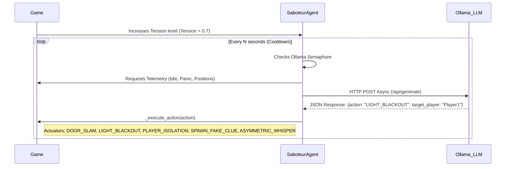
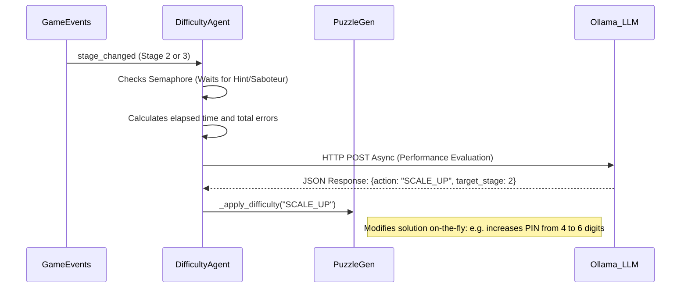
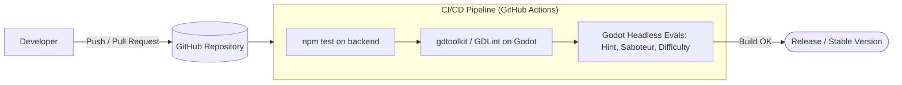
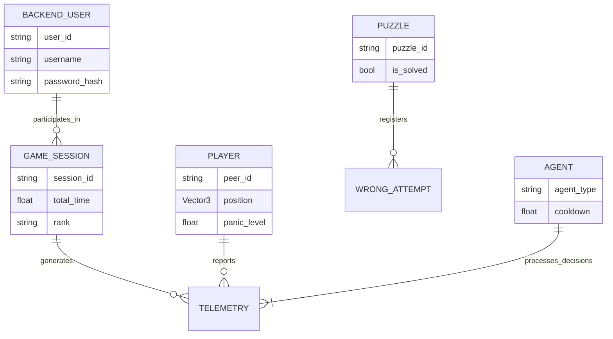
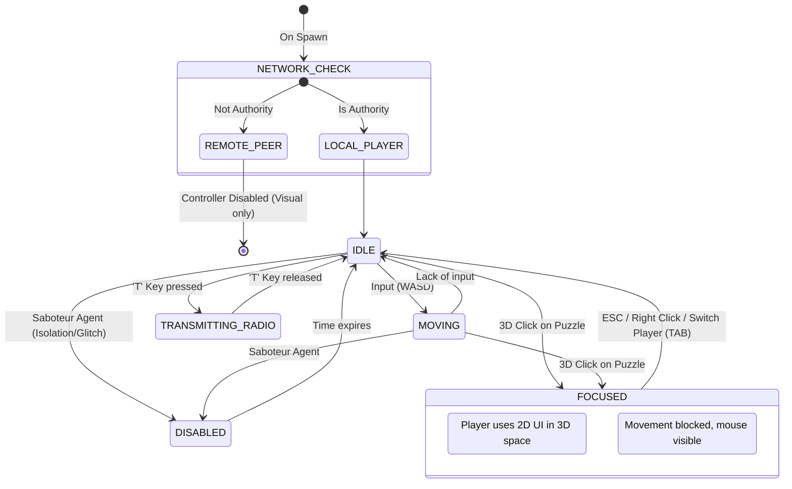

# Architecture and Workflow Diagrams - Echo Chamber Co-op

## 1. Component Architecture (UML Class Diagram)

## 2. Game Flow (Workflow / State Diagram)

## 3. Interaction Workflow (Sequence Diagram)

## 4. AI System Architecture (Integration with Ollama & External APIs)

## 5. Agent-LLM Communication Sequences (Agent-Sequence Diagrams)

### 5.1. HintAgent (On-Demand AI Director)

### 5.2. SaboteurAgent (Asymmetric Horror Director)

### 5.3. DifficultyAgent (Dynamic Difficulty Director)

## 6. CI/CD Pipeline (Workflow)

## 7. Game Data Structure (Entity Relationship Diagram - ERD)

## 8. State Machine - Player Controller

