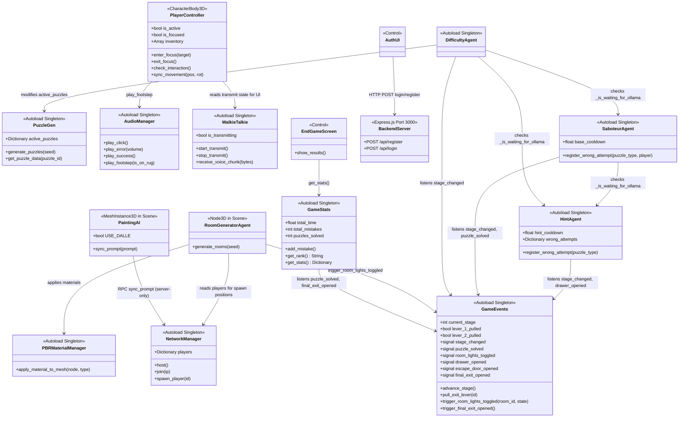
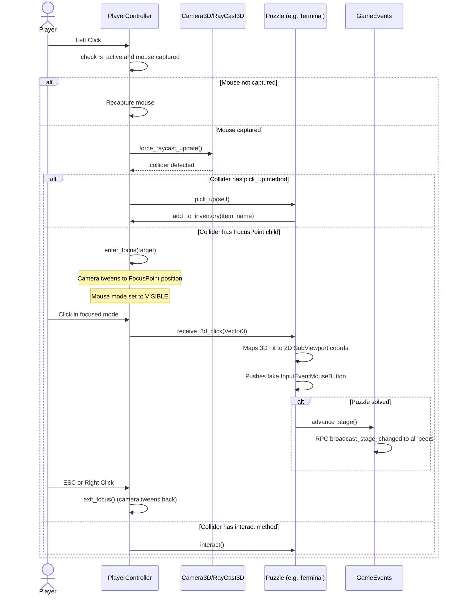
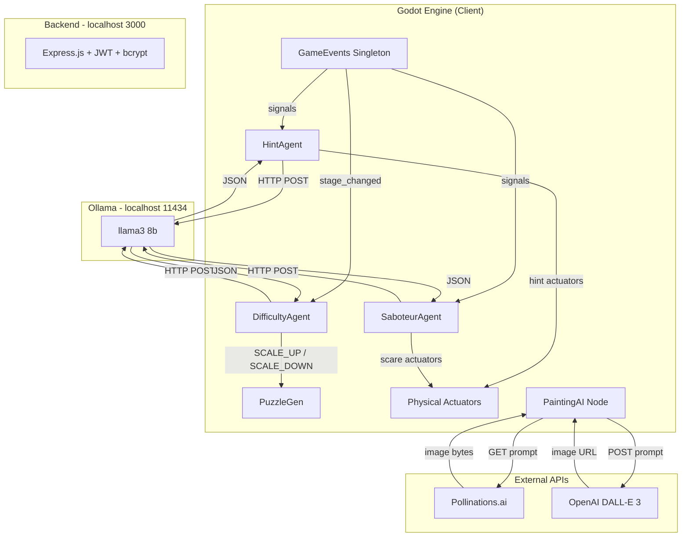
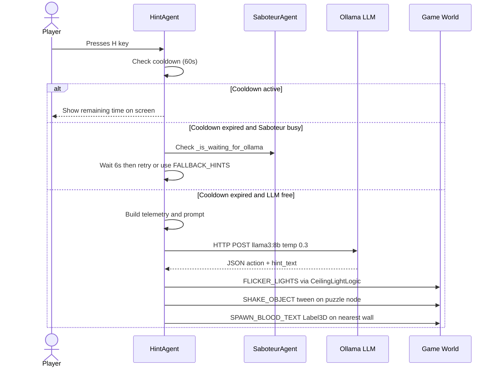
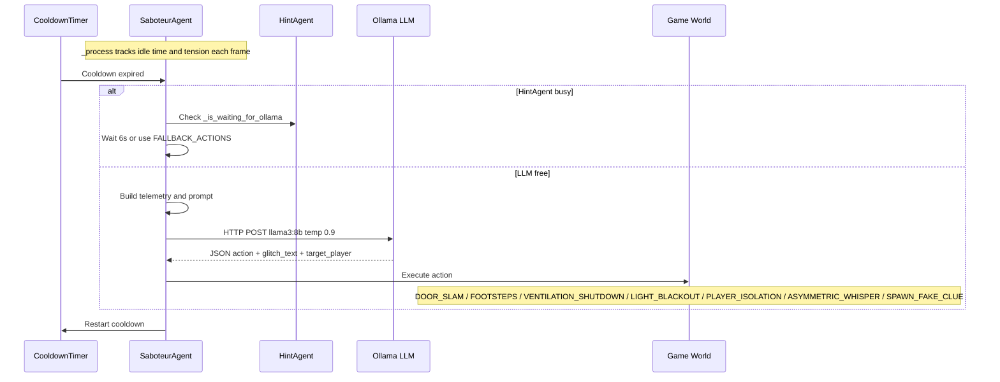
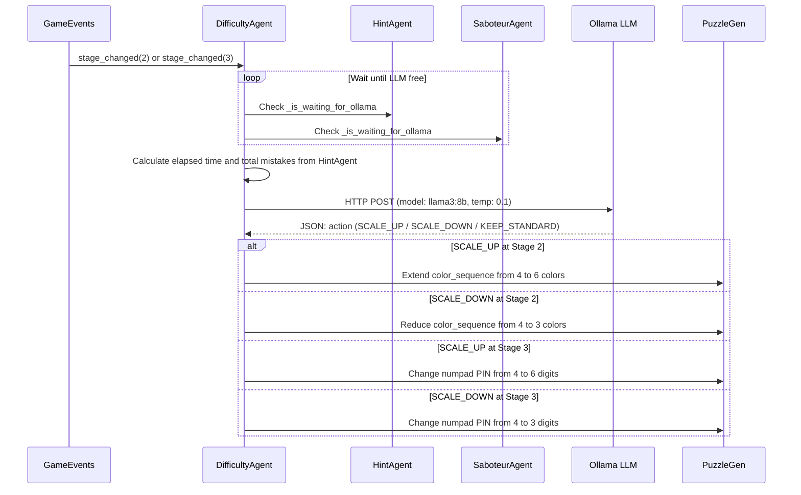
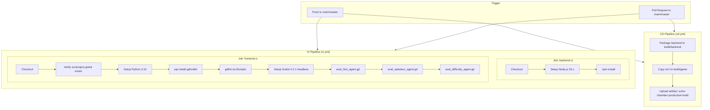
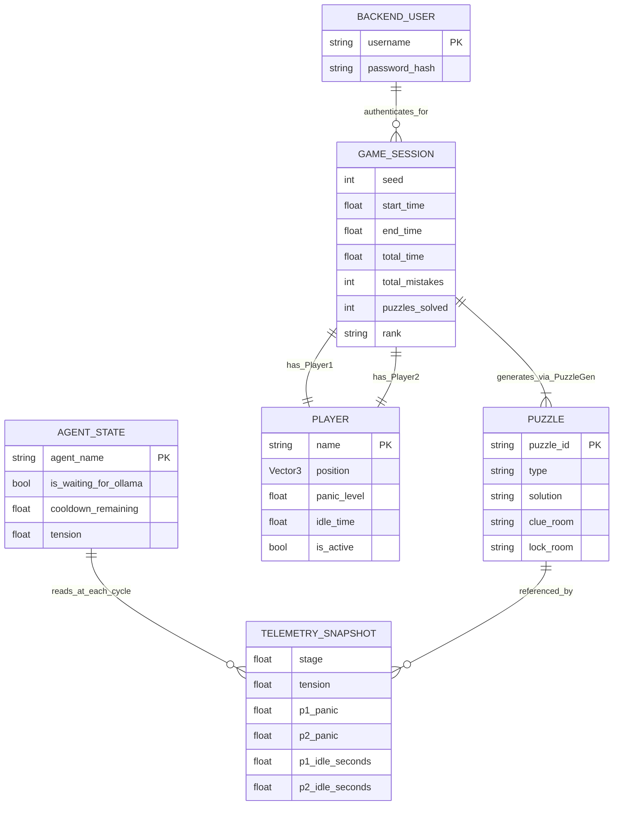
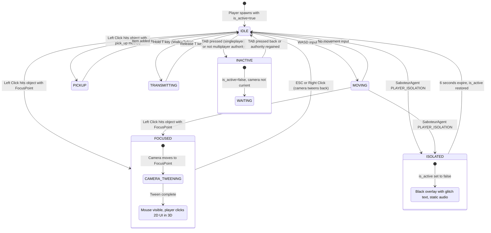

# Architecture and Workflow Diagrams - Echo Chamber Co-op

## 1. Component Architecture (UML Class Diagram)

## 2. Game Flow (State Diagram)

```mermaid
stateDiagram-v2
    [*] --> MainMenu

    MainMenu --> AuthScreen : Login / Register
    AuthScreen --> Lobby : Auth Success (JWT token)
    MainMenu --> Lobby : Skip Auth (local)

    Lobby --> RoomGeneration : Host or Join (NetworkManager ENet P2P)

    state RoomGeneration {
        [*] --> ProceduralGen : RoomGeneratorAgent.generate_rooms(seed)
        ProceduralGen --> PuzzleGeneration : PuzzleGen.generate_puzzles(seed)
        PuzzleGeneration --> SpawnPlayers : P1 in RoomA, P2 in RoomB
        SpawnPlayers --> PaintingGeneration : PaintingAI requests image (host only)
    }

    RoomGeneration --> Stage1 : RoomA starts DARK, RoomB/Corridor lit

    state Stage1 {
        [*] --> FuseBox3x3 : P2 solves 3x3 grid in RoomB
        FuseBox3x3 --> LightsOn : P1 sees pattern on MatrixMonitor in RoomA
    }
    Stage1 --> Stage1_5 : advance_stage() -> stage 2

    state Stage1_5 {
        [*] --> FindKey : P1 finds Desk Key in RoomA
        FindKey --> OpenDrawer : LockedDrawer opens, reveals color Note
    }
    Stage1_5 --> Stage2 : drawer_opened signal

    state Stage2 {
        [*] --> ColorSequence : P2 inputs colors on ColorButtonsPanel
        ColorSequence --> SafeOpens : DifficultyAgent may SCALE_UP/DOWN
    }
    Stage2 --> Stage3 : advance_stage() -> stage 3

    state Stage3 {
        [*] --> TerminalHack : P1 inputs FIREWALL, DECRYPT, CORE
        TerminalHack --> PINRevealed : Terminal shows numpad PIN
    }
    Stage3 --> Stage4 : advance_stage() -> stage 4

    state Stage4 {
        [*] --> NumpadEntry : P2 enters PIN on Numpad (DifficultyAgent may adjust)
        NumpadEntry --> EscapeDoor : escape_door_opened
        EscapeDoor --> ExitLevers : Both players pull levers simultaneously (5s window)
    }
    Stage4 --> EndGame : final_exit_opened

    state EndGame {
        [*] --> ShowResults : EndGameScreen with Rank S/A/B/C/D
    }
    EndGame --> [*]
```

## 3. Interaction Workflow (Sequence Diagram)

## 4. AI System Architecture

## 5. Agent-LLM Communication Sequences

### 5.1. HintAgent (On-Demand, Key H)

### 5.2. SaboteurAgent (Automatic, Timer-Based)

### 5.3. DifficultyAgent (Triggered at Stage 2 and 3)

## 6. CI/CD Pipeline

## 7. Game Data Structure (ERD)

## 8. State Machine - Player Controller

